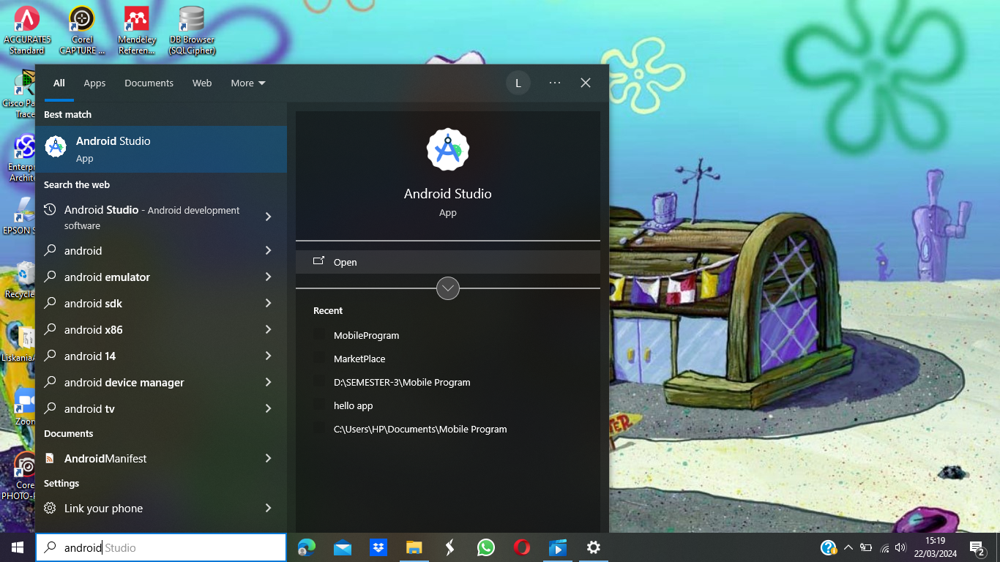
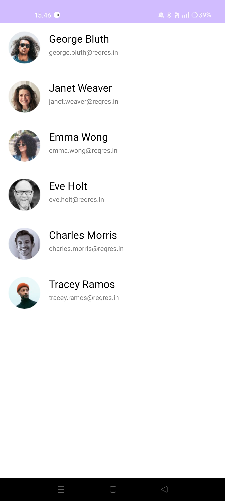

# PARSING JSON

Parsing JSON adalah proses menguraikan atau mengekstrak data yang tersimpan dalam format JSON (JavaScript Object Notation). JSON adalah format yang umum digunakan untuk pertukaran data di antara aplikasi karena kesederhanaan dan keterbacaannya. Proses parsing JSON melibatkan membaca data JSON dan mengonversinya menjadi struktur data yang dapat digunakan dalam pemrograman, seperti objek dalam bahasa pemrograman seperti JavaScript, Python, Java, dan lainnya.

Proses parsing JSON biasanya melibatkan langkah-langkah berikut:

1. **Membaca JSON**: Data JSON dibaca dari sumbernya, seperti berkas teks atau respons dari API web.

2. **Mem-parsing**: Data JSON yang dibaca kemudian dianalisis dan dipecah menjadi struktur data yang sesuai dengan aturan JSON.

3. **Konversi ke struktur data**: Data yang sudah diparsing biasanya dikonversi ke dalam struktur data yang sesuai dengan bahasa pemrograman yang digunakan. Misalnya, dalam JavaScript, JSON dapat langsung diinterpretasikan sebagai objek JavaScript; sedangkan dalam Python, JSON bisa diubah menjadi kamus (dictionary).

Proses parsing JSON memungkinkan aplikasi untuk mengakses dan menggunakan data yang diterima dari sumber eksternal, seperti server web atau layanan web, dan kemudian memanipulasi data tersebut sesuai kebutuhan aplikasi.

## Persiapan Project

Pastikan PC anda sudah menginstall aplikasi Android Studio untuk memulai Project

## Tutorial Project Android Studio

### [LINK-YOUTUBE-TUTORIAL-PARSING-JSON](https://youtu.be/W4jsxWnbLyc?si=VOMYRy8kbfNKzx_L)

## Hasil Project

# FINISH
